# Computer Architecture & Organisation – Week 10 Notes

**Lectures 48, 49, 50, 51, 52** (Prof. Indranil Sengupta, IIT Kharagpur / NIT Meghalaya, NPTEL-SWAYAM)

**Map of the week**

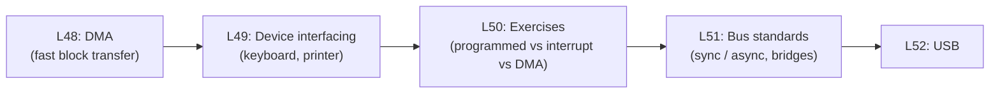

---

# Lecture 48: Direct Memory Access (DMA)

## 1. Introduction – why do we need DMA?

- In **programmed I/O** (synchronous / asynchronous / interrupt-driven) **machine instructions move the data** between I/O device and memory.
- That is **not suitable when large blocks must move at high speed** (e.g. a **disk block**).
- **DMA** = transfer of a **block of data directly between an I/O device and memory, without continuous CPU intervention.**

## 2. WHY programmed I/O is unsuitable for high-speed transfer

**Reason (a): too many instructions per word**

- **Several instructions must run for each word** moved between device and memory.
- Suppose **20 instructions per word**, **CPI = 1**, **1 GHz clock** (1 ns per instruction).
- Time per word = 20 × 1 ns = **20 ns** → maximum **1 / 20 ns = 50 M words/sec**.
- **Fast disks transfer faster than this**, so the CPU cannot keep up.

**Reason (b): disks are synchronous, fixed-rate devices**

- Many high-speed peripherals (disk) work in **synchronous mode: data comes at a fixed rate**.
- Example: **7200 rpm**, average rotational delay **4.15 ms**, **64 KB per track**.
- Once the head is on the track, sustained rate = 64 KB / 4.15 ms ≈ **15.4 MB/s**.
- This is **comparable to memory bandwidth** → **cannot be handled by programmed I/O**.

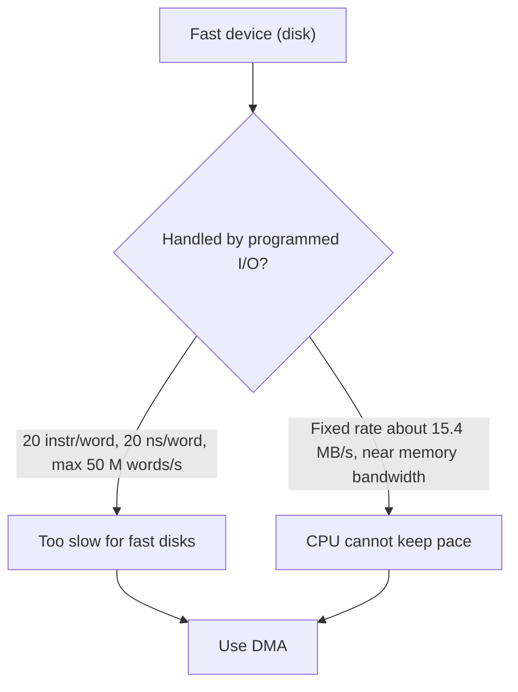

## 3. DMA Controller

- A **hardwired controller** that transfers data **directly between I/O device (e.g. disk) and memory without CPU intervention**.
  - **No instructions need to be executed** for the transfer → no per-word instruction overhead (the cause of the limit above).
  - **Maximum speed is set only by how fast memory read/write can be done.**
  - **Much faster than programmed I/O.**

**Diagram: CPU, memory, DMA controller and disk share the buses**

```
              ┌──────────┐
              │  MEMORY  │
              └─┬───┬───┬┘
   ┌─────┐   ═══╧═══╧═══╧═══════►  Address Bus
   │     │◄══════════════════════►  Data Bus
   │ CPU │   ════════════════════►  Control Bus
   │     │        ▲   ▲   ▲
   └─┬─▲─┘        │   │   │
 DMA-ACK │DMA-RQ  │   │   │
     │   │   ┌────┴───┴───┴────┐      ┌──────┐
     └───┼──►│  DMA Controller │◄────►│ DISK │
         └───┤                 │      └──────┘
             └─────────────────┘
```

(DMA-RQ goes from controller to CPU; DMA-ACK from CPU to controller; the controller has its own connection to the three buses.)

## 4. Steps involved

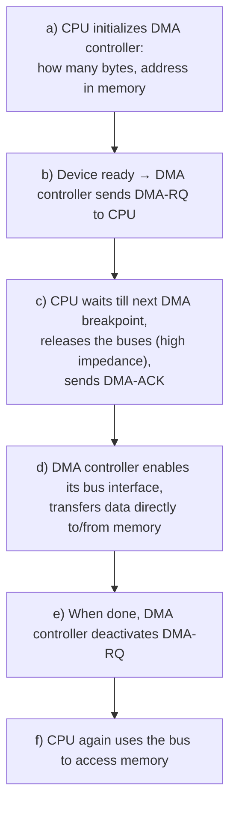

- *Why put the CPU's bus lines in **high impedance**?* So the CPU electrically disconnects and **only one master (the DMA controller) drives the buses**, avoiding conflicts.

## 5. DMA breakpoints (and why interrupts can't use the same points)

- **A DMA request can be acknowledged at the end of ANY machine cycle** (IF, ID, EX, MEM, WB).
- The slide asks: **why can't we have *interrupt* breakpoints at the end of any machine cycle?**
  - An interrupt must **make the CPU run the ISR**, so it must **save PC and PSW** and the instruction must be at a clean point; in the middle of an instruction the **processor state is only partly updated**. Hence an interrupt is acknowledged **only at the end of the instruction cycle (after WB)** (Lecture 46).
  - **DMA only needs the bus, not the CPU's state.** The CPU merely pauses, nothing has to be saved, so it can be done after **any** machine cycle.

```
   [ IF ][ ID ][ EX ][ MEM ][ WB ]
     ▲     ▲     ▲     ▲      ▲     ← DMA breakpoints (all five)
                                ▲   ← interrupt acknowledged only here
```

## 6. DMA registers and operation

- **For every DMA channel** the controller has **three registers**: a) **Memory address** b) **Word count** c) **Address of data on disk**
- **CPU initializes these registers before each DMA transfer.**
- **Before the transfer, the DMA controller requests the memory bus from the CPU.**
- **When the transfer is complete, the DMA controller sends an interrupt signal to the CPU.** (*Why?* The CPU wasn't involved in the transfer, so it needs to be told it is finished.)

**Multi-channel diagram:** the DMA controller connects to the CPU via **DMA-RQ, DMA-ACK, INTR**, and on the device side has pairs **DMA-RQ1/DMA-ACK1 … DMA-RQ4/DMA-ACK4** (one per channel/device).

```
          DMA-RQ      ┌────────────┐◄── DMA-RQ1
   ┌─────◄────────────┤            ├──► DMA-ACK1
   │ CPU │  DMA-ACK   │    DMA     │      ⋮
   │     ├────────────►  Controller│◄── DMA-RQ4
   │     │◄── INTR ───┤            ├──► DMA-ACK4
   └─────┘            └────────────┘
```

## 7. DMA transfer modes

|  | **Cycle stealing** | **Block transfer** |
| --- | --- | --- |
| How | DMA controller requests the bus for **a few cycles (1 or 2)** | Transfers the **whole block without interruption** |
| When | **Preferably when the CPU is not using memory** | Holds the bus until block done |
| Effect on CPU | DMA **steals cycles from the CPU without the CPU knowing it** | **CPU lies idle** (cannot fetch instructions from memory) |
| Speed | Slower transfer | **Maximum possible data transfer rate** |

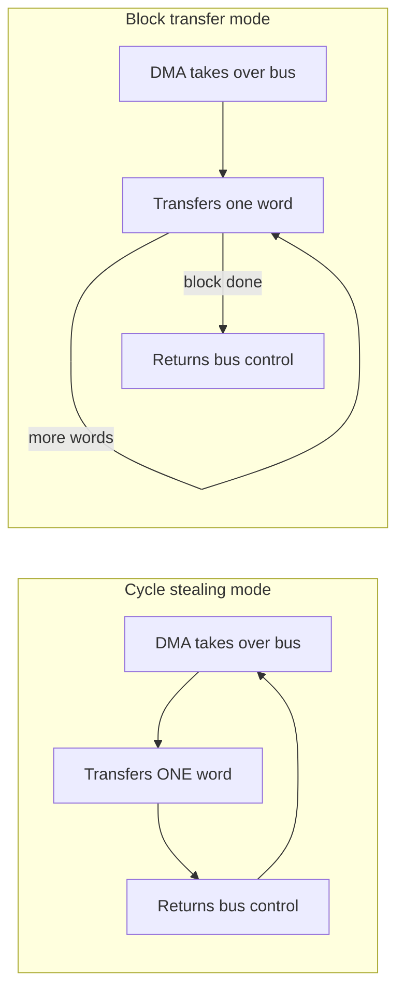

- Cycle stealing: the **take-over / transfer one word / return** loop is repeated for every word. Block transfer: the **bus is taken once, the word-transfer step repeats, and the bus is returned once at the end**.

## 8. Other applications of DMA

- **High-speed memory-to-memory block move.**
- **Refreshing dynamic memory systems**, by **periodically generating dummy read requests to the columns** (DRAM loses its contents unless periodically read/refreshed).

---

# Lecture 49: Some Example Device Interfacing

Two simple examples illustrating earlier I/O interfacing techniques: **(a) keyboard**, **(b) printer**.

## A. Keyboard Interfacing

### What is a keyboard?

- **A set of pushbutton switches (keys) interfaced to a computer.**
- **Typically arranged as a 2-D matrix**: **a key is connected to a row line and a column line at every junction.**
  - *Why a matrix?* It **minimizes the number of port lines required** (see below).

### Interfacing switches (basic idea)

- 8 switches (DIP switch) connect port lines **P1.0–P1.7** to **ground**; each line has a **pull-up resistor R to Vcc**.
  - Switch OFF → line pulled to **1**; switch ON (closed) → line shorted to ground → **0**.
- **How to check status for asynchronous transfer?** Loop: **Read from port → is it = FF (all 1s)? Yes → keep looping; No → some switch was changed/pressed.**

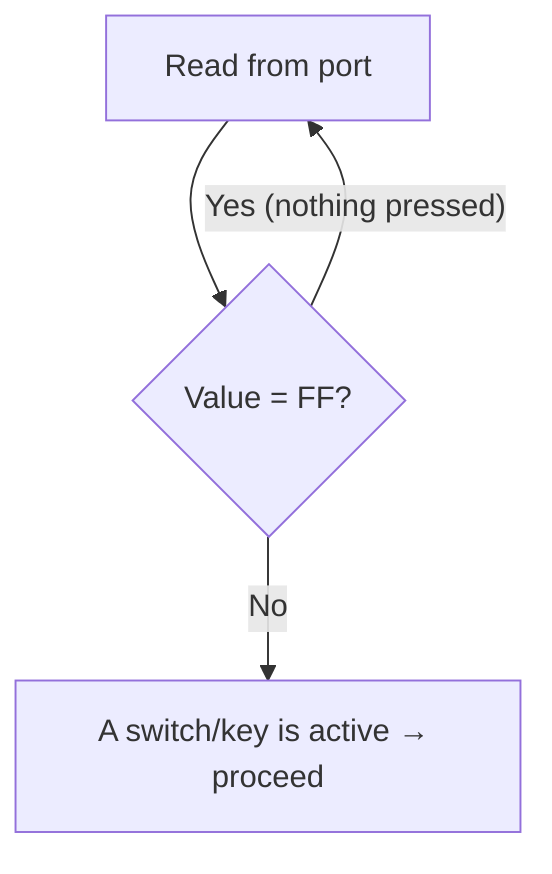

### Option 1: one key per port line

- **For N keys, N port lines are needed → too expensive.**

### Option 2: keys in matrix form

- **For N keys, port lines needed = 2√N** → **possible to interface large keyboards.**
- Example: **16 keys (hex keys 0–F) in a 4×4 matrix** → **4 row lines (X1–X4, port P1.0–P1.3)** + **4 column lines (Y1–Y4, port P2.0–P2.3)** = 8 lines instead of 16. Column lines have **10 KΩ pull-up resistors**.

```
          Y4(P2.3) Y3(P2.2) Y2(P2.1) Y1(P2.0)   (columns, pulled up to Vcc)
              │        │        │        │
 X1 (P1.0) ───┼─ [3] ──┼─ [2] ──┼─ [1] ──┼─ [0]
 X2 (P1.1) ───┼─ [7] ──┼─ [6] ──┼─ [5] ──┼─ [4]
 X3 (P1.2) ───┼─ [B] ──┼─ [A] ──┼─ [9] ──┼─ [8]
 X4 (P1.3) ───┼─ [F] ──┼─ [E] ──┼─ [D] ──┼─ [C]
```

(A key joins its row line to its column line when pressed.)

### Detecting whether ANY key is pressed

1. **Output all 0's to the rows.**
2. **Read the column port and check whether all bits are 1.**
3. **If any bit is 0 → a key has been pressed.**

- *Why does this work?* Columns are pulled up to 1; a pressed key connects its column to a row that is driven 0, pulling that column to 0.
- This **allows asynchronous mode of transfer** (CPU waits/polls for a key).

### Detecting WHICH key is pressed – keyboard scanning

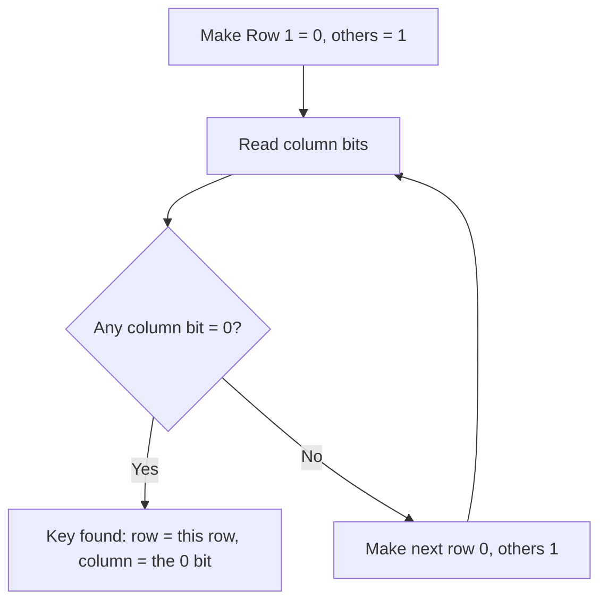

- **One row is made 0 at a time and the column bits are checked** → we check **whether some key in that particular row is pressed.**
- We get **both the row number and the column number** of the pressed key.

### Interrupt-driven keyboard interface

- **Normally all rows are connected to ground, possibly through a set of AND gates whose control input is 0.** (AND output = 0 regardless of the other input → rows held at 0.)
- **Column lines go to the inputs of a NAND gate whose output is connected to INTR.**
- **NAND output becomes 1 whenever any key is pressed** (a pressed key pulls one column to 0; NAND of inputs with a 0 gives 1).
- **Inside the ISR:** the **control inputs of the AND gates are set to 1** (so the CPU can now drive rows individually), then **normal keyboard scanning** identifies the key.
- *Why this design?* The CPU needn't poll; it is interrupted only when a key is actually pressed.

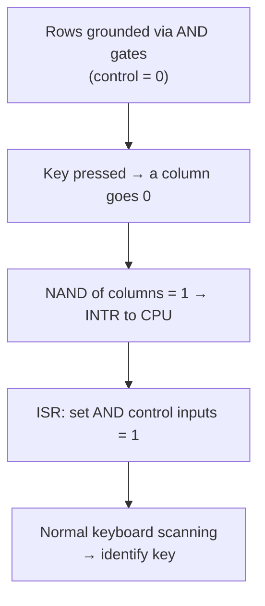

## B. Printer Interfacing

- **Older printers: serial and parallel ports**
  - **RS-232C serial data interface**
  - **LPT parallel data interface (8 data lines)**
- **Modern printers: much higher speed USB interface.** **Almost all devices today have USB interfaces.**

### LPT port (25-pin connector)

- Signals: **8 data lines, STROBE, BUSY, ACK.**
- **Handshake:**

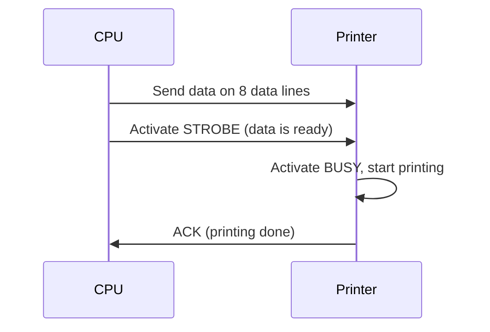

- The interface allows **asynchronous data transfer using handshaking** (the CPU doesn't know how long printing takes, so the printer tells it).

**LPT 25-pin female connector – pin assignments (from slide)**

| Pin | Signal | Pin | Signal |
| --- | --- | --- | --- |
| 1 | Data Strobe | 10 | Acknowledge |
| 2–9 | Data 0 – Data 7 | 11 | Busy |
| 12 | Paper Out | 13 | Select |
| 14 | Auto Feed | 15 | Error |
| 16 | Init | 17 | Select Input |
| 18–25 | Ground |  |  |

---

# Lecture 50: Exercises on I/O Transfer

*(The slides pose the problems; the solutions below are the worked answers, with assumptions stated.)*

**Comparison to keep in mind**

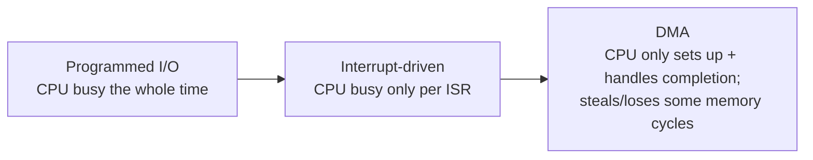

### Example 1 – Programmed I/O

**Q:** Read **2048 bytes** in programmed I/O mode. **Bus width 32 bits.** Each time an interrupt occurs it takes **4 µs** to service (transfer 32 bits). CPU time to read 2048 bytes?

- 32 bits = **4 bytes per transfer**.
- Number of transfers = 2048 / 4 = **512**.
- CPU time = 512 × 4 µs = **2048 µs ≈ 2.05 ms**. (The CPU is occupied for all of it.)

### Example 2 – DMA slowing the processor

**Q:** DMA module transfers bytes to memory from an external device at **76800 bps**. CPU fetches **2 million instructions/s**, instruction size **32 bits**. How much is the processor slowed down?

- DMA rate = 76800 bits/s = **9600 bytes/s**.
- CPU's memory traffic = 2 M × 4 bytes = **8,000,000 bytes/s** (one 32-bit fetch per instruction).
- Fraction of memory bandwidth taken by DMA = 9600 / 8,000,000 = **0.0012 = 0.12 %** slowdown.
- *Why only this small?* The device is very slow compared with memory, so DMA needs the bus only rarely.

### Example 3 – Cycle stealing

**Q:** DMA controller transfers **32-bit words** using **cycle stealing**. Words are assembled from a device sending **2400 bytes/s**. CPU executes **1 million instructions/s**. By how much is the CPU slowed?

- Words/s = 2400 / 4 = **600 words/s** → **600 stolen cycles per second**.
- CPU needs 1,000,000 cycles/s (one memory cycle per instruction).
- Slowdown = 600 / 1,000,000 = **0.0006 = 0.06 %**.

### Example 4 – Interrupt-driven I/O

**Q:** Device sends **8 KB/s continuously**; it **interrupts the CPU for every byte**. Interrupt processing takes about **100 µs**; while executing the ISR, the processor takes about **8 µs** to transfer each byte. Fraction of CPU time consumed by the device?

- Interrupts per second = 8 K = **8192**.
- CPU time per interrupt = 100 µs + 8 µs = **108 µs**.
- Time per second = 8192 × 108 µs = 884,736 µs ≈ **0.885 → about 88.5 % of CPU time**.
- *(If 8 KB/s is taken as 8000 B/s: 8000 × 108 µs = 0.864, i.e. 86.4 %.)*
- *Why so high?* Interrupting for **every byte** pays the large fixed overhead each time. This is what DMA avoids.

### Example 5 – Disk in cycle-stealing mode

**Q:** Disk with **16 surfaces, 512 tracks/surface, 512 sectors/track, 1024 bytes/sector, 3600 rpm.** Cycle stealing: whenever a **4-byte word** is ready, it is sent to memory (writing: the interface reads a 4-byte word from memory in each DMA cycle). **Memory cycle time 40 ns.** Maximum percentage of time the CPU is blocked during DMA?

- Bytes per track = 512 × 1024 = **512 KB**.
- 3600 rpm = **60 rotations/s**.
- Data rate = 512 KB × 60 = **30,720 KB/s = 31,457,280 bytes/s**.
- Words/s = 31,457,280 / 4 = **7,864,320 words/s** (one stolen memory cycle each).
- Blocked time per second = 7,864,320 × 40 ns = **0.3146 s**.
- **CPU blocked ≈ 31.5 % of the time (maximum).**

### Example 6 – DMA with setup + interrupt overhead

**Q:** Hard disk connected to a **50 MHz** processor via a DMA controller. **DMA set-up = 2000 clock cycles**, **handling DMA-completion interrupt = 1000 cycles.** Disk **transfer rate 4000 KB/s**, **average block 8 KB.** Fraction of processor time consumed by the disk, **assuming data are transferred only during idle CPU cycles**?

- Time to transfer one block = 8 KB / 4000 KB/s = **2 ms**.
- CPU cycles available in 2 ms = 50 × 10⁶ × 0.002 = **100,000 cycles**.
- CPU cycles actually consumed by the disk = set-up 2000 + interrupt 1000 = **3000 cycles** (the data transfer itself uses only idle cycles, so costs the CPU nothing).
- Fraction = 3000 / 100,000 = **0.03 = 3 %**.

### Example 7 – Interrupt-driven vs programmed

**Q:** Device with **20 KB/s** transfer rate, data transferred **byte-wise**. **Interrupt overhead = 6 µs.** Byte transfer time between interface register and CPU/memory is negligible. **Minimum performance gain of interrupt-driven mode?**

- Time between bytes = 1 / 20,000 s = **50 µs**.
- **Programmed I/O:** CPU must wait/poll for the whole 50 µs → busy **100 %** of the time.
- **Interrupt-driven:** CPU busy only **6 µs out of every 50 µs** = **12 %**.
- Gain = 100 % / 12 % ≈ **8.33 times** (this is the minimum, since programmed I/O wastes at least the entire waiting time).

---

# Lecture 51: Bus Standards

## 1. Introduction

- **A bus is a collection of wires and connectors through which data is transmitted.**
- Diagram: **CPU, Memory, Disk** all attached to a common bus with groups of lines: **Control (C0–C9), Address (A0–A31), Data (D0–D63), Power (GND, +3.3 V, ±5 V, ±12 V).**
- **Bus = address bus + data bus** (as on the slide; the diagram also shows control and power lines).
  - **Data bus:** transfers the **actual data**.
  - **Address bus:** transfers **information about the data and where it should go**.

```
  ┌─────┐   ┌────────┐   ┌──────┐
  │ CPU │   │ Memory │   │ Disk │
  └──┬──┘   └───┬────┘   └──┬───┘
 ════╧══════════╧═══════════╧═══  Control (C0–C9)
 ═══════════════════════════════  Address (A0–A31)
 ═══════════════════════════════  Data (D0–D63)
 ═══════════════════════════════  Power (GND, +3.3V, ±5V, ±12V)
```

## 2. Bus protocol, parallel vs serial

- **Bus protocol:** **rules determining the format and transmission of data through the bus.**

|  | **Parallel bus** | **Serial bus** |
| --- | --- | --- |
| Transmission | Data sent **in parallel** | Data sent **serially** |
| Advantage | **Fast** | **Low cost for long distance**, **no interference** |
| Disadvantage | **High cost for long-distance communication**; **inter-line interference at high frequency** (many close wires disturb each other) | **Slow** |

## 3. Bus terminology

- **Bus master and slaves:** **the device that controls the bus is the master; others are slaves.**
- **Local or system bus:** **connects CPU and memory.**
- **Front-side bus:** originally **connects CPU to components**; in **modern Intel architecture connects CPU to the NorthBridge chipset.**
- **Back-side bus:** **connects CPU to L2 cache.**
- **Memory bus:** **connects NorthBridge chipset to memory.**
- **AGP bus:** **connects NorthBridge chipset to the GPU.**
- **ISA, PCI, Firewire, USB, PCI-Express bus:** **connect motherboard to peripherals.**

**Intel system diagram (source: Intel Corp., as on slide):**

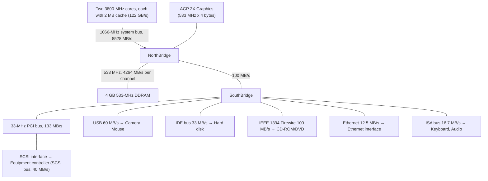

## 4. Bus features

- **Bus width:** **number of wires available in the bus for transferring data.**
- **Bus bandwidth:** **total amount of data that can be transferred over the bus per unit time.**

| Bus | Width (bit) | Bandwidth |
| --- | --- | --- |
| 16-bit ISA | 16 | 15.9 MB/s |
| EISA | 32 | 31.8 MB/s |
| PCI | 32 | 127.2 MB/s |
| 64-bit PCI 2.1 (66 MHz) | 64 | 508.6 MB/s |
| AGP 8x | 32 | 2,133 MB/s |
| USB 2 | 1 | Slow 1.5 Mbit/s, Full 12 Mbit/s, Hi-Speed 480 Mbit/s |
| Firewire 400 | 1 | 400 Mbit/s |
| PCI-Express 16x v2 | 16 | 8,000 MB/s |

## 5. Synchronous vs asynchronous bus

- **Synchronous bus:** **a common clock between sender and receiver synchronizes bus operation.**
- **Asynchronous bus:** **no common clock; bus master and slave must *handshake* during communication.** (Handshake replaces the clock, so each side knows when the other is ready.)

### Example 1: Synchronous memory read (signals: clock Φ, Address, Data, MREQ, RD; cycles T1–T3)

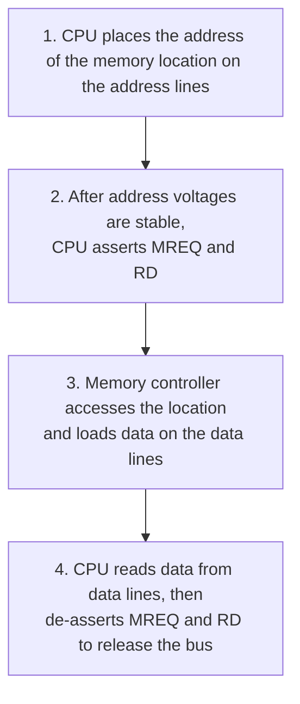

- Timing is tied to **leading and trailing clock edges**; address valid first, data valid only near the end (T3).
- *Why wait until the address is stable before asserting MREQ/RD?* So memory never acts on a half-settled, wrong address.

### Example 2: Asynchronous memory read (adds **MSYN** = master sync, **SSYN** = slave sync)

```mermaid
sequenceDiagram
  participant CPU as CPU (master)
  participant MEM as Memory controller (slave)
  CPU->>MEM: 1. Address on address lines
  CPU->>MEM: 2. (address stable) assert MREQ and RD
  CPU->>MEM: 3. Assert MSYN; memory accesses location
  MEM->>CPU: 4. Data on data lines, assert SSYN
  CPU->>MEM: 5. Take data; de-assert MREQ, RD and MSYN
  MEM->>CPU: 6. De-assert SSYN
```

- *Why MSYN/SSYN?* With no clock, **MSYN says "I'm ready/request made"** and **SSYN says "data is ready"**; each step waits for the other's signal (handshake), so a slow memory simply takes longer.

## 6. Bridge-based bus architectures

- **The system has many buses, segregated by bridges.**
- **Advantage: different buses can operate in parallel.** (Fast devices aren't held back by slow ones.)
- **Intel follows this architecture.**

```
            ┌─────┐
            │ CPU │
            └──┬──┘
        ┌──────┴───────┐ ── RAM (memory)
        │  Northbridge │ ── AGP (video card)
        └──────┬───────┘ ── PCI Express
        ┌──────┴───────┐ ── PCI bus
        │  Southbridge │ ── Real time clock
        └──────────────┘ ── APM (power management), USB, other devices
```

---

# Lecture 52: Universal Serial Bus (USB)

## 1. Introduction

- **USB is the most popular external bus standard today.**
  - **Allows connection of almost all types of peripherals** (keyboard, mouse, printer, scanner, mobile phones, disks, pen drives, camera, etc.).
- **Facilitates high-speed data transfer:**

| Version | Year | Speed |
| --- | --- | --- |
| USB 1.1 | 1998 | up to 12 Mbps |
| USB 2.0 | 2000 | up to 480 Mbps |
| USB 3.0 | 2008 | up to 5 Gbps |
| USB 3.1 | 2013 | up to 10 Gbps |

## 2. History – why USB was created

- **7 companies (Compaq, DEC, IBM, Intel, Microsoft, NEC, Nortel) started developing it in 1994.**
- **Main goals:**
  - **Simplify connecting external devices by replacing the variety of connectors** available earlier.
  - **Simplify software configuration of connected devices.**
- **First version USB 1.0 appeared in 1996**, followed by many generations; **USB 3.1 was the latest** at the time.

## 3. How data is transmitted

- **Data is sent serially using differential NRZI encoding.**

| Bit to be sent | Previous line state | New line state |
| --- | --- | --- |
| 0 | 0 | 1 |
| 0 | 1 | 0 |
| 1 | 0 | 0 |
| 1 | 1 | 1 |

- **Reading the table:** a **0 bit toggles the line**; a **1 bit keeps the line unchanged.**
- **Bit stuffing:** used **to ensure a minimum bit-toggle frequency.** **A 0 is inserted whenever a sequence of six 1's is encountered.**
  - *Why?* A 1 causes **no transition**; a long run of 1s would give a flat line, and the **receiver could lose synchronization**. The stuffed 0 forces a toggle.
  - Slide example: `1101 1111 1101 0100` → `1101 1111 1` **`0`** `1 0 1 0100`, written on the slide as `1101 1111 10101 0100` (the inserted 0 is highlighted in red after the six 1s).

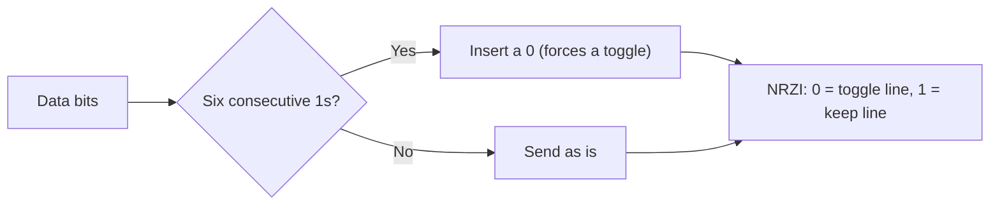

## 4. USB connectors

- **Two pre-defined connectors in any USB system:**
  - **Type-A plug:** **elongated cross-section**; **inserts into a Type-A receptacle on a downstream port on a USB host or hub**; **carries both power and data.**
  - **Type-B plug:** **near-square cross-section with top exterior corners beveled**; **part of a removable cable**; **inserts into an upstream port on a device (e.g. printer).**
- **For smaller devices (mobile phones, digital cameras): mini and micro USB connectors** have been developed.

| Type-A (host/hub side) | Type-B (device side) | Mini | Micro |
| --- | --- | --- | --- |

## 5. Bus hierarchy

```
 Host Computer
   CPU ◄─CPU bus─►┐         ┌◄─Memory bus─► Main Memory
                  ▼         ▼
              ═════ System Bus ═════
                       ║  USB internal bus and i/f
                  [ USB Host Hub ]
 - - - - - - - - - - - - ║ - - - - - - - - - - - -
                       ║  USB external bus and i/f
 External Device    [ USB Device ]
```

## 6. Bus topology

- **Connects the computer (host) to peripheral devices; largely successful in replacing serial and parallel ports.**
- **Tiered star topology:**
  - **All devices are linked to a common point, the root hub.**
  - **Spec supports up to 127 devices.**
  - **4-wire cable: power, ground, and two differential signaling lines.**
  - **USB is a polled bus – all transactions are initiated by the host.** (*Why?* Devices never start a transfer; the host asks each in turn, which keeps control simple.)

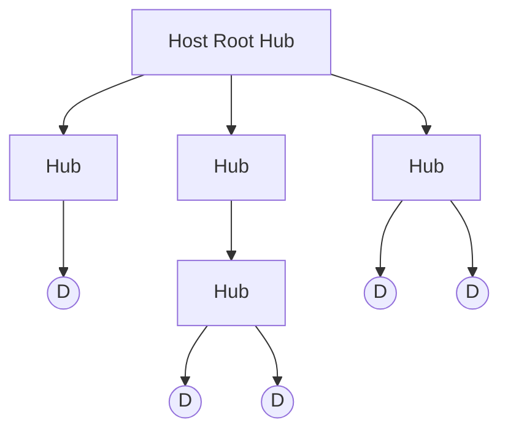

(D = functional USB device.)

## 7. The three roles

**USB Host**

- **Device that controls the entire system (usually a computer).**
- **Processes data arriving to and from the USB port.**
- **Contains a sophisticated set of software drivers:** they **schedule and compose USB transactions** and **access individual devices to obtain configuration information.**
- **Software dependence makes USB hard to use on stand-alone systems (no OS support).**
- **The physical interface to the USB root hub is the USB Host Controller.**

**USB Hub**

- **Checks for new devices and maintains status information of child devices.**
- **Acts as a repeater**, **boosting strength of upstream and downstream signals.**
- **Electrically isolates devices from one another**, **allowing an expanded number of devices**:
  - **allows malfunctioning devices to be removed;**
  - **allows slower devices to be placed on a faster branch.**
- **Can be purchased as stand-alone devices.**

**USB Devices**

- **All functional USB devices are slaves: they only respond to reads or writes, never initiate any.**
- **May indicate a need to transmit/receive data through polling.**
- **Contain registers that identify relevant configuration information.**
- **Exist in conjunction with a matching set of software drivers inside the host system.**

## 8. USB software interfaces

```
      HOST SYSTEM                         USB DEVICE
  ┌──────────────────┐              ┌───────────────────┐
  │ Client Software  │◄────────────►│ Function          │
  │        ⇕         │              │        ⇕          │
  │ USB System Sw    │◄────────────►│ USB Logical Device│
  │        ⇕         │              │        ⇕          │
  │ USB Host Control.│◄────────────►│ USB Bus Interface │
  └──────────────────┘              └───────────────────┘
```

| Layer (host) | Decides / does |
| --- | --- |
| **Client Software** | **Determines what transactions are required with a given device: what data is to be transferred?** |
| **USB System Software** | **Scheduling and configuration of data transfers: when and how often is data transferred?** |
| **USB Host Controller** | **Composes and regulates data transfers: how data appear to the functional device? how does the system keep track of data sent and received?** |

Each host layer talks to its matching layer on the device.

## 9. Future of USB

- **USB Type-C plug:**
  - **About the same size as micro USB connectors.**
  - **Can deliver 20 volts and 5 amps (100 watts)** → **can charge laptops and phones.**
- **Thunderbolt 3 port uses the same port type as USB-C**; **peak speed up to 40 Gbps**; **available on Apple machines.**

---

*End of Lectures 48–52 (Week 10).*
