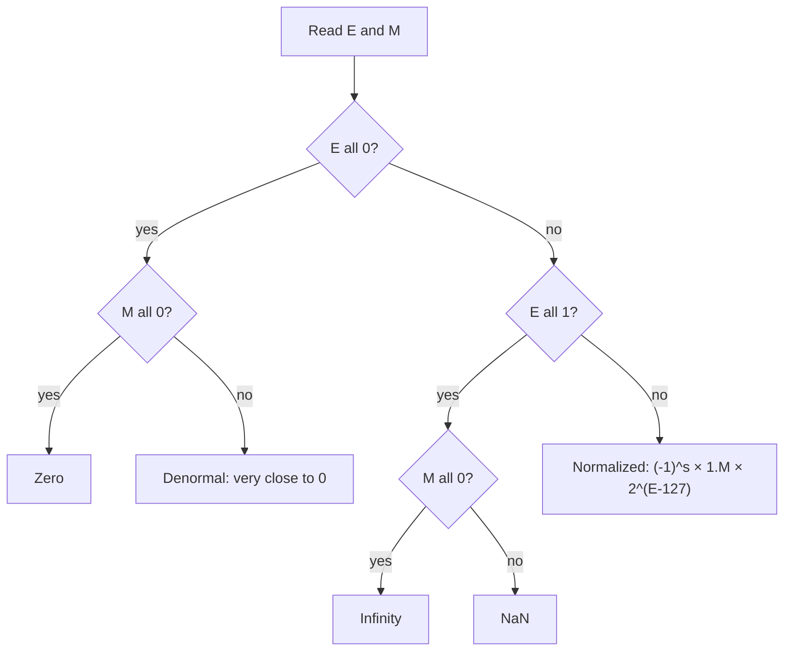
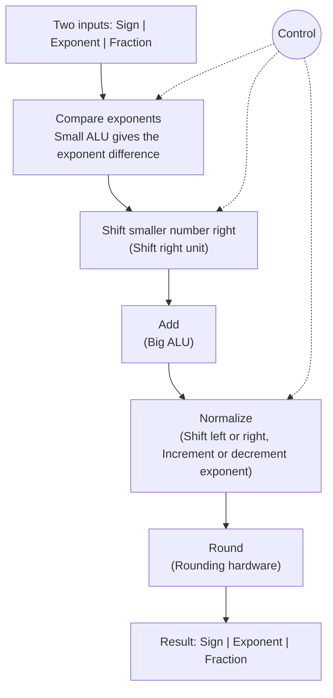
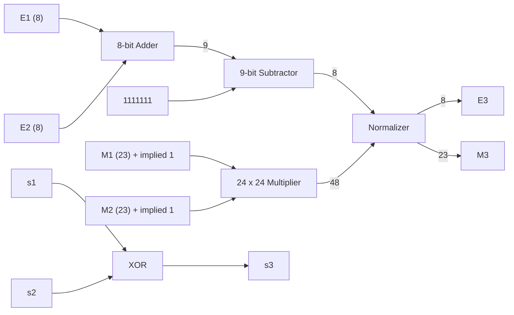
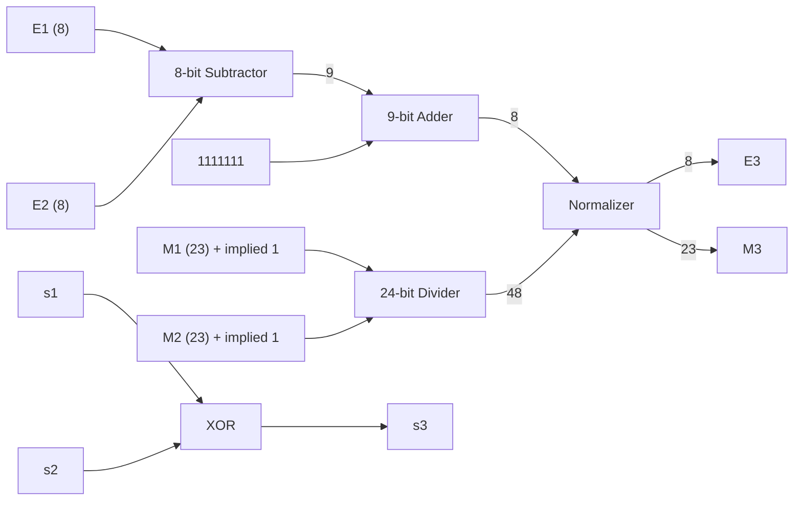

# Lecture 38: FLOATING-POINT NUMBERS

**Prof. Indranil Sengupta**, Dept. of CSE, IIT Kharagpur (NPTEL, with NIT Meghalaya)
Source: `week8-slides.pdf`. Lecture 38 covers slides 1 to 17, and Lecture 39 (below) covers slides 18 to 36. The PDF also holds Lectures 40 to 42, which are not covered here.

## Conventions
- Only slide content is covered, plus my explanations of it. Slide numbers are in brackets, like **[s4]**.
- Notation follows the professor: $F=(-1)^s\,M\times 2^{EXP}$, where **EXP** is the real exponent and **E** is the stored (biased) exponent field.
- Every topic has a **Why** block. Math is in LaTeX.

## Contents
1. Limitations of Representation
2. IEEE-754 Representation and Conversion
3. Encoding, Significant Digits, Implied Bit, Exponent Range
4. Normalized Representation
5. Special Values
6. Rounding
7. Exercise 1: Decoding (worked)

---

## Topic 1: Limitations of Representation

### Background: fractional binary numbers [s2, s3]
A binary number with a fractional part:

$$B = b_{n-1}\,b_{n-2}\ldots b_1 b_0\,.\,b_{-1}\,b_{-2}\ldots b_{-m}\qquad\Longrightarrow\qquad D=\sum_{i=-m}^{n-1} b_i\,2^{i}$$

This is called a **fixed-point number**, because the radix point's position is fixed. If the radix point is allowed to move, we get a **floating-point representation**.

**Why the formula works:** every bit position has weight $2^i$. Positions to the right of the point have negative $i$, so they carry the weights $\tfrac12,\tfrac14,\tfrac18,\ldots$

| Binary | Expansion | Decimal |
|---|---|---|
| 1011.1 | $2^3+2^1+2^0+2^{-1}$ | 11.5 |
| 101.11 | $2^2+2^0+2^{-1}+2^{-2}$ | 5.75 |
| 10.111 | $2^1+2^{-1}+2^{-2}+2^{-3}$ | 2.875 |

Observations from the slide:
- Shift right by 1 bit means divide by 2. Shift left by 1 bit means multiply by 2.
- $0.111111\ldots_2 < 1.0$.

**Why:** a shift moves every digit one weight up or down, and neighbouring weights differ by a factor of 2. And $0.11\ldots1$ ($m$ ones) $=1-2^{-m}$, which always falls short of 1.

### Limitation A: fixed point lacks flexibility [s5]
Fixed point has $n$ integer bits and $m$ fraction bits, chosen in advance. It **cannot represent very small or very large numbers**, e.g. $2.53\times10^{-26}$ or $1.7562\times10^{+35}$.

**Why:** reaching $10^{35}$ needs over 100 integer bits, and reaching $10^{-26}$ needs about 90 fraction bits, both in the same number. That would be a huge word for every value. **Solution: floating point.**

### Limitation B: only $x/2^k$ is exact [s4]
In the fractional part, we can only represent numbers of the form $x/2^k$ exactly. Everything else has a **repeating bit pattern** that never converges.

| Number | Binary |
|---|---|
| 3/4 | 0.11 |
| 7/8 | 0.111 |
| 5/8 | 0.101 |
| 1/3 | 0.10101010101 [01] ... |
| 1/5 | 0.001100110011 [0011] ... |
| 1/10 | 0.0001100110011 [0011] ... |

- More bits means a more accurate representation.
- We sometimes see $(1/3)\times 3 \ne 1$.

**Why only $x/2^k$:** the weights after the point are $\tfrac12,\tfrac14,\ldots$, so any finite sum has a power-of-2 denominator. A fraction like $1/3$, $1/5$ or $1/10$ has another prime factor in its denominator, so it can never terminate.

**Why $(1/3)\times3\neq1$:** $1/3$ must be cut off, e.g. $0.0101_2=5/16$. Then $3\times\tfrac{5}{16}=\tfrac{15}{16}=0.1111_2$, which is below 1 (the observation above). More bits get closer, but never reach 1 exactly.

---

## Topic 2: IEEE-754 Representation and Conversion

### The representation [s5, s6]
A number $F$ is a triplet $\langle s, M, E\rangle$ such that

$$\boxed{F=(-1)^{s}\,M\times 2^{E}}$$

- $s$ is the **sign bit**: negative $=1$, positive $=0$.
- $M$ is the **mantissa**, normally a fraction in the range $[1.0,\,2.0]$.
- $E$ is the **exponent**, which weights the number by a power of 2.

**Encoding**

| | Total bits | E | M |
|---|---|---|---|
| Single precision | 32 | 8 | 23 |
| Double precision | 64 | 11 | 52 |

```
+---+-----------+-----------------------+
| s |     E     |           M           |
+---+-----------+-----------------------+
```

**Why three fields:** it is scientific notation in binary. The sign gives the direction, M gives the digits (precision), and E gives the scale (range). Topic 3 shows that the precision comes from M and the range from E.

### Conversion technique (decimal to IEEE-754), as used in the slides' examples
1. **Sign:** set $s$ from the sign of the number, then work with the magnitude.
2. **Binary:** convert the number to binary.
3. **Normalize:** write it as $1.xxxx\times2^{EXP}$ by moving the point.
4. **Stored exponent:** $E=EXP+BIAS$ (127 for single), written in 8 bits.
5. **Stored mantissa:** the bits after the point, padded with zeros on the right up to 23 bits. The leading 1 is not stored.
6. Pack as `s | E | M`, and group into nibbles for the hex form.

**Why these steps:** steps 2 and 3 put the number in the form $M\times2^{EXP}$ that the format expects. Step 4 makes the exponent unsigned (Topic 3). Step 5 drops the leading 1 because it is implied (Topic 3).

### Example 1 [s10]: $F = 15335$
- $15335_{10}=11101111100111_2=1.1101111100111\times2^{13}$
- Mantissa stored: $M=1101111100111\,0000000000_2$ (13 bits, padded to 23)
- $EXP=13$, $BIAS=127\Rightarrow E=13+127=140=10001100_2$

```
 s |    E     |           M
 0 | 10001100 | 11011111001110000000000   =  0100 0110 0110 1111 1001 1100 0000 0000
                                          =  466F9C00 (hex)
```

**Why 13:** the binary number has 14 digits, so the point must move 13 places left to leave a single 1 in front of it.

### Example 2 [s11]: $F = -3.75$
- $-3.75_{10}=-11.11_2=-1.111\times2^{1}$
- $M=11100000000000000000000_2$
- $EXP=1\Rightarrow E=1+127=128=10000000_2$

```
 s |    E     |           M
 1 | 10000000 | 11100000000000000000000
```

> **Slide typo?** The slide prints `40700000` in hex. With $s=1$ the first nibble is `1100`, so the hex should be **`C0700000`**. `40700000` is $+3.75$. Worth confirming with your professor.

---

## Topic 3: Encoding, Significant Digits, Implied Bit, Exponent Range

### Points to note [s7]
- The number of **significant digits** depends on the number of bits in **M**.
  - 7 significant digits for a 24-bit mantissa (23 bits + 1 implied bit).
- The **range** depends on the number of bits in **E**.
  - $10^{38}$ to $10^{-38}$ for an 8-bit exponent.

### How many significant digits?

$$2^{24}=10^{x}\;\Rightarrow\;24\log_{10}2=x\log_{10}10\;\Rightarrow\;x=7.2\;\Rightarrow\;\textbf{7 significant decimal places}$$

**Why this works:** 24 bits can distinguish $2^{24}$ different mantissas. We ask what power of 10 gives the same count. Each bit is worth $\log_{10}2\approx0.301$ decimal digits.

### The implied bit [s9]
The mantissa is coded with an **implied leading 1** (so 24 bits in total):

$$M = 1.xxxx\ldots x$$

Here $xxxx\ldots x$ is the 23 bits **actually stored**. We get the extra leading bit **for free**.
- $xxxx\ldots x=0000\ldots0\Rightarrow M$ is minimum $=1.0$.
- $xxxx\ldots x=1111\ldots1\Rightarrow M$ is maximum $=2.0-\varepsilon$, where $\varepsilon=2^{-23}$ is the weight of the last stored bit.

**Why is it called "implied"?** The 1 is part of the value but is not in the stored bits. The format itself tells you it is there.
**Why is it always 1?** Normalization (Topic 4) leaves exactly one nonzero digit left of the point, and in binary the only nonzero digit is 1.
**Why skip storing it?** A bit that is always the same carries no information. Skipping it turns 23 stored bits into 24 bits of precision.

### Exponent encoding and range [s8]
Let the actual exponent be $EXP$ (the number is $M\times2^{EXP}$). The exponent is stored as a **biased** value:

$$E=EXP+BIAS,\qquad BIAS=127\;(2^{8-1}-1)\ \text{single},\qquad BIAS=1023\;(2^{11-1}-1)\ \text{double}$$

Permissible range of $E$: $\;1\le E\le254$ (the all-0 and all-1 patterns are not allowed).

**Range of the exponent, step by step**
1. 8 bits give $E\in\{0,\ldots,255\}$.
2. Remove all-0 ($E=0$) and all-1 ($E=255$), so $E\in[1,254]$.
3. Subtract the bias: $EXP\in[1-127,\;254-127]=[-126,\;+127]$.
4. Convert the largest power to decimal [s7]:

$$2^{127}=10^{y}\;\Rightarrow\;127\log_{10}2=y\log_{10}10\;\Rightarrow\;y=38.1\;\Rightarrow\;\text{maximum exponent}\approx 38\ \text{(decimal)}$$

So the range is about $10^{-38}$ to $10^{38}$.

**Why all-0 and all-1 are not allowed:** they are reserved for special values (Topic 5).
**Why a bias, not a sign bit or two's complement:** the stored $E$ is a plain unsigned number that grows as the real exponent grows, so no sign handling is needed in the exponent field.
**Why $2^{k-1}-1$:** it places the middle of the usable range $[1,254]$ at $EXP=0$, so negative and positive exponents are almost balanced ($-126$ to $+127$).

---

## Topic 4: Normalized Representation

### What is it? [s8, s9]
A number is **normalized** when it is written as

$$M\times2^{EXP}\quad\text{with}\quad M=1.xxxx\ldots x,\qquad 1.0\le M<2.0$$

i.e. exactly one nonzero digit (a 1) sits to the left of the binary point.

### How is it different?
The same value can be written in many ways. For $3.75$:

$$11.11_2\times2^{0}\;=\;\mathbf{1.111_2\times2^{1}}\;=\;0.1111_2\times2^{2}$$

All three are equal, and only the middle one is normalized.

### Why do we need it?
- **Uniqueness:** each value gets exactly one bit pattern, instead of many.
- **Implied bit:** the "free" leading 1 (Topic 3) is only valid because the leading digit is guaranteed to be 1.
- **Maximum precision:** leading zeros in M would waste stored bits. The slides say the number of significant digits depends on the bits in M, so every bit should carry information.

### How to convert
Move the binary point until a single 1 is left of it, and fix EXP so the value stays the same:
- Point moved **left** by $k$: $EXP \mathrel{+}= k$.
- Point moved **right** by $k$: $EXP \mathrel{-}= k$.

**Why:** from the slides, a shift by 1 bit multiplies or divides by 2. Moving the point is such a shift, and the exponent is the power of 2, so changing EXP by 1 cancels it exactly.

**From the slides:**
- $11101111100111_2$: point moved 13 left, so $1.1101111100111\times2^{13}$ [s10].
- $11.11_2$: point moved 1 left, so $1.111\times2^{1}$ [s11].

Then store M as the bits after the point (padded to 23) and $E=EXP+BIAS$.

### Where normalization breaks [s13]
- **Zero** has no 1 anywhere, so it can't be normalized and needs a special code.
- **Very small numbers:** normalizing them would need an exponent below the minimum possible value. These become **denormal numbers** (Topic 5).

---

## Topic 5: Special Values [s12, s13]

The reserved exponent patterns give the special cases.

| E | M | Represents |
|---|---|---|
| $000\ldots0$ | $=000\ldots0$ | the value **0** |
| $000\ldots0$ | $\ne 000\ldots0$ | numbers very close to 0 (**de-normalized**) |
| $111\ldots1$ | $=000\ldots0$ | **$\infty$** |
| $111\ldots1$ | $\ne 000\ldots0$ | **NaN** (Not-a-Number) |
| everything else ($1\ldots254$) | any | normalized number |



**Side notes from the slide**
- **Zero** is represented by the all-zero string.
- **NaN** represents cases where no numeric value can be determined, like uninitialized values, $\infty\times0$, $\infty-\infty$, and the square root of a negative number.

### Summary of number encodings [s13]

```
 NaN                                                                     NaN
 |==|  -inf    -Normalized     -Denorm   -0 +0   +Denorm    +Normalized   +inf  |==|
        |---------|--------------|----------|.|.|----------|-------------|------|
```

**Denormal numbers:** very small magnitudes (close to 0), such that trying to normalize them would give an exponent below the minimum possible value.
- Mantissa with **leading 0's** and exponent field equal to **zero**.
- The number of significant digits gets **reduced** in the process.

**Why each case exists**
- **Zero:** a normalized $1.xxx\times2^{EXP}$ is never 0, so zero needs its own code. $E=0,M=0$ makes the all-zero word equal zero. The number line shows both $-0$ and $+0$, so the sign bit still works.
- **Denormals:** without them there would be a gap between 0 and the smallest normalized number. With $E=0$ the mantissa has no implied 1 (it has leading zeros), which lets the numbers shrink toward 0.
- **Fewer significant digits:** leading zeros in M use up stored bits, so fewer bits are left to carry information.
- **$\infty$ and NaN:** these cover results that are not ordinary numbers, such as an overflow, or operations with no defined numeric answer.

---

## Topic 6: Rounding [s14, s15]

### The setting
Adding two single-precision numbers:
1. Shift one mantissa **right** to align the exponents.
2. Add the mantissas.
3. Take the **first 23 bits** of the sum and **discard the residue $R$**.

> The slide says "beyond 32 bits", but the context (23-bit mantissa) suggests it means beyond 23 bits. Probably a typo.

**Why rounding is needed:** aligning and adding gives more bits than M can hold. We keep 23 and must decide what to do with the discarded part $R$.

### The four IEEE-754 rounding modes
| Mode | Meaning |
|---|---|
| a) **Truncation** | just drop $R$ |
| b) **Round to $+\infty$** | like the **ceiling** function |
| c) **Round to $-\infty$** | like the **floor** function |
| d) **Round to nearest** | pick the closest representable value |

### How rounding is implemented: two temporary bits
```
 1. [ 23 kept bits ]  |  r  s s s s ...
                         \_____________/
                          residue R
```
- **Round bit $r$:** the **MSB** of the residue $R$.
- **Sticky bit $s$:** the **logical OR** of all the *rest* of the bits of $R$.

**Decisions** (here `+` is logical OR and `.` is logical AND):

| Case | Condition | In words |
|---|---|---|
| a) $R>0$ | $r+s=1$ | at least one residue bit is 1 |
| b) $R=0.5$ | $r\cdot s'=1$ | $r=1$ and $s=0$: exactly half |
| c) $R>0.5$ | $r\cdot s=1$ | $r=1$ and $s=1$: more than half |

Here $R$ is measured in units of the last kept bit.

**Why these conditions work**
- $r$ is the first discarded bit, and its weight is exactly **half** a unit of the last kept bit.
- $s$ remembers whether *anything* is left after that. Hence, with $r=1$: $s=0$ means exactly half, and $s=1$ means more than half.
- If $r=0$ and $s=1$, something was lost but it is less than half.
- The sticky bit saves us from keeping every discarded bit: one OR-ed bit is enough to tell these cases apart.

**Illustration** (my example, using the slide's rules):

| Residue $R$ | $r$ | $s$ | Reading |
|---|---|---|---|
| `0000` | 0 | 0 | $R=0$: nothing lost |
| `0011` | 0 | 1 | $0<R<0.5$ |
| `1000` | 1 | 0 | $R=0.5$ |
| `1010` | 1 | 1 | $R>0.5$ |

My reading of how the slide's tests are used: the $R>0$ test fits the directed modes (ceiling/floor), where any lost bit matters. The 0.5 tests fit round-to-nearest. The slide itself doesn't map tests to modes.

### Renormalization after rounding
If rounding gives a result that is **not in normalized form**, we must re-normalize it.

**Why:** rounding up adds 1 to the last kept bit, which can carry all the way, e.g. $1.111\ldots1+\text{1 unit}=10.000\ldots0$. That has two digits left of the point, so we shift right by 1 and increase EXP by 1 to get $1.000\ldots0\times2^{EXP+1}$.

---

## Topic 7: Exercise 1, Decoding single-precision numbers [s16]

### Method
1. Split the 32 bits as `s (1) | E (8) | M (23)`. Write nibbles first, then regroup.
2. **Check E first:** all 0s means the zero/denormal branch, all 1s means the $\infty$/NaN branch, otherwise it is normal.
3. For a normal number: $EXP=E-127$, $M=1.(\text{23 bits})$, and $F=(-1)^s\,M\times2^{EXP}$.

**Why check E first:** the special values (Topic 5) are decided by E, and then by whether M is all zeros. Only the remaining numbers need the formula.

### Fully worked: (c) `0100 1111 1101 0000 0000 0000 0000 0000`
**Step 1: split.** The first bit is $s$. The next 8 bits are $E$. The remaining 23 are $M$.

```
0100 1111 1101 0000 ...
0 | 1001 1111 | 101 0000 0000 0000 0000 0000
s |    E      |            M
```

- $s=0$, so the number is positive.
- $E=10011111_2=128+16+8+4+2+1=159$.
- $M$ field $=101000\ldots0$.

**Step 2: check E.** $E=159$ is neither $0$ nor $255$, so it's a **normal** number.

**Step 3: apply the formula.**
- $EXP=159-127=32$
- $M=1.101_2=1+\tfrac12+\tfrac18=1.625$ (the leading 1 is the implied bit)

$$F=+1.625\times2^{32}=\tfrac{13}{8}\times2^{32}=13\times2^{29}=\mathbf{6{,}979{,}321{,}856}\approx6.98\times10^{9}$$

**Why the shape of the answer is what it is:** E fixes the scale ($2^{32}$), and M fixes the digits (1.625).

### Your turn (hints)
- **(a)** `0011 1111 1000 ...`: write out the 8 E bits (they straddle two nibbles). What is EXP? What does an all-zero M field give?
- **(b)** `0100 0000 0110 ...`: E is `10000000`. M starts `11`. What is $1.11_2$?
- **(d)** `1000 0000 ...`: sign bit 1, all else 0. Which branch of the flow does this land in?
- **(e)** `0111 1111 1000 ...`: E all ones, M all zeros.
- **(f)** `0111 1111 1101 0101 ...`: E all ones, M not all zeros.

<details>
<summary>Answers (try first!)</summary>

| | Result |
|---|---|
| a | $+1.0$ |
| b | $+3.5$ |
| c | $13\times2^{29}=6{,}979{,}321{,}856$ |
| d | $-0$ |
| e | $+\infty$ |
| f | NaN |

</details>

---

# Lecture 39: FLOATING-POINT ARITHMETIC

**Prof. Indranil Sengupta**, Dept. of CSE, IIT Kharagpur (NPTEL, with NIT Meghalaya)
Same conventions as Lecture 38: slide content only, slide numbers in brackets, a **Why** for each idea, math in LaTeX.

## Contents
1. Floating-Point Addition/Subtraction
2. Floating-Point Multiplication
3. Floating-Point Division
4. Floating-Point Arithmetic in MIPS

> **Reading the slides' exponents.** The step lists write $M_1\times2^{E_1}$, $M_2\times2^{E_2}$ and talk about the stored fields. The worked examples use the *real* exponents (e.g. "8 + 1 = 9"). Lecture 38 gave $E=EXP+BIAS$, so the two views agree once the bias is accounted for. Each topic below says how.

---

## Topic 1: Floating-Point Addition/Subtraction

### The steps [s19]
Two numbers $M_1\times2^{E_1}$ and $M_2\times2^{E_2}$, where $E_1>E_2$ (say).
1. Select the number with the **smaller exponent** ($E_2$) and **shift its mantissa right** by $(E_1-E_2)$ positions.
2. Set the **exponent of the result** equal to the **larger exponent** ($E_1$).
3. Carry out $M_1\pm M_2$, and determine the **sign** of the result.
4. **Normalize** the resulting value, if necessary.

**Why align first:** you can only add digits of equal weight. $M_1\times2^{E_1}$ and $M_2\times2^{E_2}$ have different weights, so we rewrite the smaller one with the exponent $E_1$. A right shift by 1 divides by 2 (Lecture 38), so shifting the mantissa right by $E_1-E_2$ while raising its exponent from $E_2$ to $E_1$ leaves its value unchanged.
**Why shift the smaller-exponent number, to the right:** it only loses bits off the *low* end (small contribution). Shifting the larger one left would push its high bits out and destroy the result. The bits shifted out beyond the 24-bit window become the **residue** that is rounded (Lecture 38, Rounding).
**Why the difference is the same for $E$ and $EXP$:** $E_1-E_2=(EXP_1+BIAS)-(EXP_2+BIAS)=EXP_1-EXP_2$. The bias cancels.
**Why normalize at the end:** the sum or difference may no longer be in the form $1.xxx$ (see the two examples).

### Addition example [s20]: $F_1=270.75$, $F_2=2.375$
- $F_1=100001110.11_2=1.0000111011\times2^{8}$
- $F_2=10.011_2=1.0011\times2^{1}$
- Shift the mantissa of $F_2$ right by $8-1=7$ positions, then add (mantissas written as 24 bits, implied 1 included):

```
   1000 0111 0110 0000 0000 0000
 +        1 0011 0000 0000 0000 0000 000        <- F2's mantissa after the 7-place shift
 ------------------------------------------
   1000 1000 1001 0000 0000 0000 | 0000 000     <- last 7 bits = Residue
```

- Result: $1.00010001001\times2^{8}$

**Check:** $270.75+2.375=273.125=100010001.001_2=1.00010001001\times2^8$. ✓
**Why the extra 7 bits:** the shift pushes the last 7 bits of $F_2$'s mantissa past the 24-bit window. The slide marks them as the residue. Here they are all 0, so $R=0$ and no rounding is needed.
**Why no normalization step was needed:** the sum still has a single 1 to the left of the point.

### Subtraction example [s21]: $F_1=270.75$, subtract $F_2=224$
- $F_1=1.0000111011\times2^{8}$
- $F_2=224=11100000_2$, written on the slide as $1.111\times2^7$

> **Slide typo?** $224=11100000_2$ has three ones, so it is $1.11\times2^{7}$. The slide's $1.111\times2^7$ would be $240$. The subtraction rows on the slide do use $1.11$ (shifted to $0.111$), so only the written form is off.

- Shift the mantissa of $F_2$ right by $8-7=1$ position, and subtract:

```
   1000 0111 0110 0000 0000 0000      (F1: 1.0000111011)
 - 0111 0000 0000 0000 0000 0000      (F2 shifted: 0.111)
 ------------------------------
   0001 0111 0110 0000 0000 0000
```

- **Normalize:** the first 1 is at the 4th position, so shift the mantissa **left 3** positions and **decrement $E$ by 3**.
- Result: $1.01110110\times2^{5}$

**Check:** $270.75-224=46.75=101110.11_2=1.0111011\times2^5$. ✓
**Why normalization is needed here:** subtracting two close numbers cancels the leading digits, leaving leading zeros (`0001...`). They must be shifted out so the mantissa is $1.xxx$ again.
**Why the exponent goes down by 3:** shifting the mantissa left 3 places multiplies it by $2^3$, so the exponent must drop by 3 to keep the value the same.

### Addition hardware [s22]
The slide shows the datapath, labelled stage by stage on its right edge:



- A **Control** block drives the 2-way selectors (0/1 boxes) that steer which operand goes where.
- The five stages match the four steps of [s19], plus the **Round** stage from Lecture 38.

**Why a small ALU and a big ALU:** comparing exponents works on a few exponent bits (small), while adding mantissas works on the full mantissa width (big).
**Why Normalize can shift left or right and adjust the exponent:** after subtraction the result may need a left shift (like the example above). After addition it may need a right shift when the sum reaches 2 or more, and the exponent goes up by 1.

---

## Topic 2: Floating-Point Multiplication

### The steps [s23]
Two numbers $M_1\times2^{E_1}$ and $M_2\times2^{E_2}$.
1. **Add** the exponents $E_1$ and $E_2$ and **subtract the BIAS**.
2. **Multiply** $M_1$ and $M_2$ and determine the **sign** of the result.
3. **Normalize** the resulting value, if necessary.

**Why subtract the bias:** the stored fields are $E_1=EXP_1+BIAS$ and $E_2=EXP_2+BIAS$, so
$$E_1+E_2=(EXP_1+EXP_2)+2\cdot BIAS$$
The result should hold only one bias, so we subtract one.
**Why exponents add:** $2^{a}\times2^{b}=2^{a+b}$, and the mantissas multiply separately.
**Why normalize can be needed:** both mantissas are in $[1,2)$, so the product is in $[1,4)$. If it is 2 or more, shift right by 1 and add 1 to the exponent.

### Example [s24]: $F_1=270.75$, $F_2=-2.375$
- $F_1=1.0000111011\times2^{8}$
- $F_2=-10.011_2=-1.0011\times2^{1}$
- Add the exponents: $8+1=9$ (real exponents, so no bias needed in the arithmetic)
- Multiply the mantissas: $1.0000111011\times1.0011=1.01000001100001$
- Result: $1.01000001100001\times2^{9}$

> **Sign:** the slide's result has no minus sign. One operand is negative, so the true result is **negative**: $-1.01000001100001\times2^{9}=-643.03125$, which equals $270.75\times(-2.375)$. ✓

**Why no normalization here:** the product mantissa $1.0100\ldots$ is already in $[1,2)$.

### Multiplication hardware [s25]



**Why each block:**
- **8-bit adder, then 9-bit subtractor:** add $E_1+E_2$, then subtract the bias. $1111111_2=127$ is the single-precision BIAS. The sum of two 8-bit values can need a 9th bit, hence the 9-bit width.
- **24 x 24 multiplier:** each mantissa is 23 stored bits plus the implied 1, so 24 bits. A product of two 24-bit numbers has up to 48 bits.
- **XOR of $s_1,s_2$:** the product is negative exactly when one operand is negative and the other isn't.
- **Normalizer:** takes the exponent and the 48-bit product and delivers the final $E_3$ (8 bits) and $M_3$ (23 bits). Cutting 48 bits down to 23 means discarded bits, so rounding applies as in Lecture 38.

---

## Topic 3: Floating-Point Division

### The steps [s26]
Two numbers $M_1\times2^{E_1}$ and $M_2\times2^{E_2}$.
1. **Subtract** the exponents $E_1$ and $E_2$ and **add the BIAS**.
2. **Divide** $M_1$ by $M_2$ and determine the **sign** of the result.
3. **Normalize** the resulting value, if necessary.

**Why add the bias back:** $E_1-E_2=(EXP_1+BIAS)-(EXP_2+BIAS)=EXP_1-EXP_2$. The bias cancels completely, so we add it back to get a proper stored exponent. This is the mirror image of multiplication, where there was one bias too many.
**Why normalize can be needed:** both mantissas are in $[1,2)$, so the quotient is in $(0.5,\,2)$. If $M_1<M_2$ the quotient is below 1 and needs a left shift.

### Example [s27]: $F_1=270.75$ divided by $F_2=-2.375$
- $F_1=1.0000111011\times2^{8}$
- $F_2=-1.0011\times2^{1}$
- Subtract the exponents: $8-1=7$
- Divide the mantissas: $0.1110010$
- Result: $0.1110010\times2^{7}$
- After normalization: $1.110010\times2^{6}$

> **Sign:** as in the multiplication example, the slide omits it. The true result is negative: $270.75/(-2.375)=-114$.

**Check:** $1.110010_2\times2^6=\tfrac{57}{32}\times64=114$. ✓
**Why the normalization step:** $M_1/M_2=1.0000111011/1.0011\approx0.89<1$. The leading digit is 0, so shift left 1 place (the mantissa doubles) and decrement the exponent from 7 to 6.

### Division hardware [s28]



It is the multiplier's datapath with the exponent operations swapped: **subtract, then add bias**, and a **divider** in place of the multiplier. The sign logic (XOR) and the Normalizer are the same as in multiplication.

---

## Topic 4: Floating-Point Arithmetic in MIPS

### Registers [s30, s31]
The **MIPS32** architecture defines these floating-point registers (FPRs):
- **32 registers, F0 to F31**, each 32 bits wide. Each can hold one **single-precision** number.
- **Double-precision** numbers are stored in **even-odd pairs** of FPRs, e.g. (F0,F1), (F10,F11).
- In addition, there are **five special-purpose FPU control registers**: FIR, FCCR, FEXR, FENR, FCSR.

**Why pairs for double:** a double is 64 bits and an FPR holds 32, so a double needs two registers.

### Typical floating-point instructions [s32, s33, s34]

| Group | Instructions on the slides |
|---|---|
| **Load and store** | load word, load double-word, store word, store double-word |
| **Data movement** | move between integer registers and FP registers; move between integer registers and FP control registers |
| **Arithmetic** | absolute value, compare, negate, add, subtract, multiply, divide, square root, multiply add, multiply subtract |
| **Rounding** | truncate, ceiling, floor, round |
| **Format conversion** | single to double, double to single |

**Why the rounding group matches Lecture 38:** truncate, ceiling ($\to+\infty$), floor ($\to-\infty$) and round (to nearest) are the same four rounding ideas IEEE-754 supports.
**Why data-movement instructions exist:** floating-point values live in their own register file, so there must be a way to move data between the integer and FP register files.

### Example [s35]: add a scalar $s$ to a vector $A$
```c
for (i=1000; i>0; i--)
    A[i] = A[i] + s;
```

```
Loop:  L.D    F0, 0(R1)
       ADD.D  F4, F0, F2
       S.D    F4, 0(R1)
       ADDI   R1, R1, -8
       BNE    R1, R2, Loop
```

**Setup given on the slide**
- `R1` initially points to `A[1000]`.
- `(F2,F3)` contains the scalar $s$.
- `R2` is initialized such that `8(R2)` is the address of `A[1]`.
- Double precision (64 bits): the numbers live in pairs `(F0,F1)`, `(F2,F3)` and `(F4,F5)`.

**Line by line**
| Instruction | What it does | Why |
|---|---|---|
| `L.D F0, 0(R1)` | load the double at address `R1` into the pair (F0,F1) | get `A[i]` into a register |
| `ADD.D F4, F0, F2` | (F4,F5) = (F0,F1) + (F2,F3) | $A[i]+s$; the instruction names only the even register of each pair |
| `S.D F4, 0(R1)` | store (F4,F5) back at address `R1` | write the updated `A[i]` |
| `ADDI R1, R1, -8` | `R1` = `R1` - 8 | each double is 8 bytes (64 bits), so this moves to the previous element, `A[i-1]` |
| `BNE R1, R2, Loop` | go back to `Loop` while `R1` is not equal to `R2` | the loop test |

**Why the loop stops after exactly 1000 passes:** `8(R2)` is the address of `A[1]`, and `A[1]` sits 8 bytes after `A[0]`, so `R2` holds the address of `A[0]`. After processing `A[1]`, the `ADDI` makes `R1` equal to the address of `A[0]`, which equals `R2`, so `BNE` falls through. Counting down from `A[1000]` to `A[1]` is 1000 elements.
**Why compare against a pointer instead of keeping a counter `i`:** `R1` already does double duty as the address and the loop variable, so the only extra work per pass is the one `BNE` against `R2`.

---
